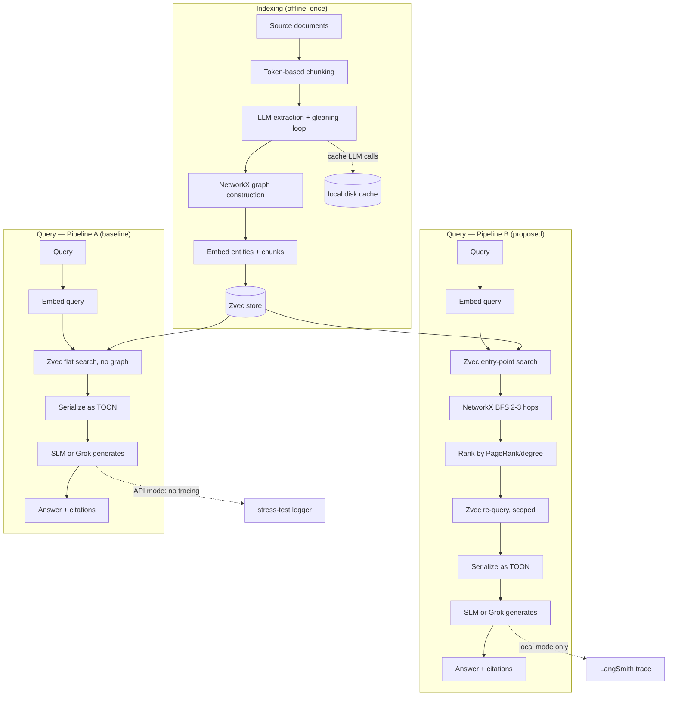

# PRD: Lightweight Graph-RAG with Zvec Retrieval and Local SLM Reasoning

## 1. Problem & Goal

**Problem:** Existing graph-RAG systems (Microsoft GraphRAG, GNN-RAG) make retrieval "smart" via an expensive precomputation step — LLM-written community summaries or a trained GNN — and use server-based or cloud-oriented vector stores. This makes them slow to index, expensive to run, and hard to deploy locally.

**Goal:** Build a graph-RAG pipeline that replaces the expensive precomputation step with (a) cheap, untrained structural graph filtering and (b) fast, in-process hybrid retrieval via Zvec — and show it lets a small local LLM (SLM) match the accuracy of systems that need a big model or a trained GNN, at a fraction of the latency/cost, while also surviving concurrent load.

**Two pipelines to build and compare (this is the whole point — not just one system):**
- **Pipeline A (baseline):** flat vector-only RAG — no graph structure used at retrieval time.
- **Pipeline B (proposed):** structural graph filter → Zvec hybrid retrieval → SLM.

## 2. Knowledge Base / Data Source

- Domain-neutral: any document/entity corpus works (news articles, Wikipedia pages, research abstracts). A few hundred documents is enough; this is a research prototype, not a production ingestion system.
- Store raw source documents as-is (plain text/markdown) — this is your ground truth for citations and for building the gold Q&A eval set later.
- Keep a `source_doc_id` and full original text addressable at all times — every entity/chunk must be traceable back to it.

## 3. Chunking

- **Method:** token-based sliding window with overlap — matches GraphRAG's own `TokenTextSplitter` approach.
- **Chunk size:** ~300-600 tokens for entity extraction (large chunks measurably hurt extraction recall). A separate, larger chunk size (~1000-1500 tokens) for citation-display text is fine — extraction and citation chunking don't need to match.
- **Overlap:** ~10-15% of chunk size so entities/relationships spanning a chunk boundary aren't lost.
- **Tool:** use your target model's actual tokenizer (`tiktoken` or the Qwen tokenizer) to count tokens, not `len(text)//4`.

## 4. Extraction (Entity & Relationship)

- **Method:** LLM-based structured extraction — one call per chunk, returning entities (name, type, description, exact source sentence) and relationships (source, target, type, description, exact source sentence) as JSON.
- **Gleaning loop (verified in Microsoft's `GraphExtractor`, add this — it was missing from the first draft):** after the first extraction pass over a chunk, re-prompt the LLM up to `max_gleanings` times with "did you miss any entities or relationships?" This catches entities the first pass skipped, at the cost of extra LLM calls at index time (acceptable — happens once, offline). Start with `max_gleanings=1`, measure recall before increasing it.
- **Critical requirement:** force the LLM to return the *exact source sentence* for every entity/relationship — gives sentence-level attribution instead of chunk-level.
- Can run on the local SLM too if the whole pipeline (including indexing) should be local — expect noisier extraction than a larger model; worth an ablation.

## 5. Embedding

- **Primary model:** `nomic-embed-text` — Ollama-native (matches the "everything local via Ollama" story used for the SLM too), 8192-token context, best size/quality balance for CPU-local deployment per current benchmarks.
- **Ablation set:** `Qwen3-Embedding-0.6B` (same model family as the SLM — clean same-family comparison point) and `all-MiniLM-L6-v2` (kept as the legacy/dated baseline row, not the default — flagged in current sources as a 2021-era model that leaves retrieval quality on the table if still used a year later).
- **Selection requirements (not just leaderboard rank):**
  | Requirement | Why | Target |
  |---|---|---|
  | CPU-viable, low RAM | 3GB budget, no dedicated GPU | sub-1B params, ideally 100-600M |
  | Retrieval-specific score, not overall MTEB average | MTEB blends classification/clustering/STS — not representative of our use case | check NDCG@10 retrieval subscore specifically |
  | Fast single-query embedding | Query-time latency matters for the stress test | sub-50ms per query on CPU |
  | Context length ≥ 600 tokens | Must cover largest extraction/citation chunks without truncation | 512-8192 token window |
  | Permissive license | No legal friction for a research project | Apache 2.0 / MIT |
  | Ollama-servable or `sentence-transformers` compatible | Fits existing local stack without a new serving mechanism | native Ollama pull or trivial HF load |
  | Validated on the actual corpus, not just the leaderboard | MTEB rank doesn't always reflect in-domain retrieval — top-3 MTEB models have ranked as low as 5th/7th on in-domain evals elsewhere | run the gold eval set (Section 18) as the real decision-maker, not the MTEB number alone |
- **What gets embedded:** each entity (`name: description`) and each raw-text chunk. (Microsoft also embeds community-report content — we don't, since we don't generate community reports; see Section 15.)
- **Batch embedding at index time**, not per-query.

## 5.1 Small Local LLM (SLM) Selection

Two jobs, one model family, tested at multiple sizes so the paper shows a
graceful-degradation curve rather than a single data point:

| Model | Params | Role | Why |
|---|---|---|---|
| **Qwen3 4B** (primary) | 4B | Extraction + generation | Good instruction-following for structured extraction, runs on CPU within the ~3GB budget at Q4, same family as the `Qwen3-Embedding-0.6B` embedding ablation |
| **Qwen3 1.7B** (ablation) | 1.7B | Lower-bound test | The real "how small can we go" data point — the paper's claim is stronger showing graceful degradation 4B→1.7B than testing only one size |
| **Phi-4-mini** (ablation) | 3.8B | Cross-family comparison | Punches above its weight on structured reasoning/logic specifically — worth a comparison row outside the Qwen3 family |
| Grok (API) | — | Stress-test only, not part of the accuracy comparison | Provides real concurrent capacity a local SLM can't; used to isolate whether the *retrieval layer* (not the LLM) bottlenecks under load |

Skip multimodal variants (Gemma 3/4, Qwen3.5) — their added capability
(vision input) isn't used here and just costs RAM/latency budget.

**Caveat:** the params/role table above is built from third-party model
rankings, not verified against this project's own gold eval set — same
caveat as the MTEB embedding leaderboard in Section 5. Pull all three via
Ollama and run the actual 30-50 question gold set (Section 18) against
each; that comparison, not the leaderboard score, is what goes in the
paper.

## 6. Vector Store: Zvec

- **Why Zvec over GraphRAG's own choices (LanceDB / Azure AI Search / CosmosDB):** in-process (no server/daemon), native **hybrid search** (dense vector + full-text/BM25 + scalar filters) in one call, built-in reranker (weighted fusion / RRF) — no separate reranking model or keyword-search system needed.
- **Schema:** one collection for entities (vector + scalar fields: `entity_type`, `source_doc`, `hop_distance_from_query`, `pagerank_score`), one collection for raw chunks (vector + scalar fields: `source_doc`, `chunk_index`).
- **Practical note:** Zvec is very new (open-sourced Feb 2026, v0.5.0 June 2026) — call its native API (`zvec.open()`, `.insert()`, `.query()`) directly, don't wait for a framework wrapper.

## 7. Similarity Method: Hybrid (Cosine + BM25/Full-Text)

- **Cosine (dense)** catches semantic/paraphrased matches.
- **BM25/full-text (Zvec native)** catches exact-match queries — named entities, IDs — a known weak spot of pure vector RAG.
- **Fusion:** Zvec's built-in RRF/weighted fusion combines both into one ranking, in a single call.
- Hybrid beats either alone on most RAG benchmarks — use it, don't pick one.

## 8. Graph Type & Structure

- **Type:** directed, heterogeneous property graph — typed entity nodes, typed relationship edges, both carrying provenance metadata (source doc, source sentence).
- **Library:** NetworkX — sufficient at research-demo scale (thousands of nodes), zero infra overhead.
- **Temporal option:** add `timestamp`/`valid_from`/`valid_to` to edges and filter traversal by time window at query time, if a dynamic-graph variant is wanted later.

## 9. Graph Retrieval

- **Step 1 — entry points:** Zvec hybrid search on the entity collection finds top-k relevant entities (replaces GraphRAG's precomputed community index — computed on-demand instead).
- **Step 2 — structural expansion:** bounded BFS (2-3 hops) from entry points over the NetworkX graph, **ranked by PageRank/degree centrality** before keeping anything (the reference notebook found online skips this ranking step — plain unranked BFS floods context with everything in-radius).
  - **Correction, stated honestly:** PageRank-ranked graph retrieval is *not* novel on its own — HippoRAG / HippoRAG 2 (NeurIPS 2024/2025) already established Personalized PageRank as a standard, widely-cited graph-retrieval baseline (LinearRAG, SAG, MemORAI, and others all benchmark against it). The actual claim in this PRD is narrower and still unaddressed by that lineage: pairing PageRank-style structural retrieval with a **genuinely small local LLM (sub-2B), a fast in-process embedded hybrid engine (Zvec), and systematic cost/latency/concurrency benchmarking** — none of which HippoRAG's own papers, or anything benchmarked against it, report. See Section 15.5 for the fuller related-work comparison.
- **Step 3 — re-narrow with Zvec:** verbalize the ranked candidates, run a second Zvec hybrid query scoped to just those candidates, keep the top-N final evidence pieces. This two-stage narrowing (structural, then semantic) is the core mechanism the paper tests.

## 10. Reranking

- Use **Zvec's built-in reranker** (weighted fusion/RRF) — don't add a separate cross-encoder unless evaluation shows it's needed (a second model contradicts the lightweight thesis).
- If needed: `bge-reranker-base` is the standard lightweight fallback, documented as a trade-off, not a default.

## 11. Output Format to the SLM: TOON, Not Raw JSON

- TOON (Token-Oriented Object Notation) preserves the JSON data model but drops repeated braces/keys using indentation + tabular rows. Published benchmarks show **~42.6% fewer tokens than JSON at comparable-or-better accuracy** (72.2% vs 71.4% in one benchmark) on uniform-array data — exactly what a retrieved-evidence list is.
- **Caveat, test don't assume:** one benchmark (arXiv:2603.03306) found TOON's savings can be offset by "prompt tax" (the one-shot example needed to teach the model TOON syntax) on short contexts. Measure this directly as an ablation (JSON vs TOON: tokens/latency/accuracy) rather than assuming the win.

## 12. TF-IDF

- Zvec's native BM25/full-text already covers the keyword-matching role TF-IDF would play — don't build it as a production component.
- Optional: keep a simple TF-IDF+cosine baseline (via `scikit-learn`) as an extra "classic IR" row in the results table, for one more credible comparison point.

## 13. Tool Plugins / Agentic Loop

- Not needed for the core system — base pipeline is retrieve-once, answer-once.
- Only add if implementing the re-retrieval-on-low-confidence loop: expose `expand_hop(node_id)` and `widen_time_window(range)` as function-calling tools. v2 feature, not required for the core comparison.

## 14. Caching Layer (new — verified against Microsoft's `graphrag-cache` / `graphrag-llm/cache`)

- Microsoft memoizes every LLM call by prompt hash so re-running the pipeline doesn't re-pay for extraction. We need the same, or every dev iteration re-runs (and re-pays for) extraction from scratch.
- **Prototype version:** a local disk cache (`diskcache`, or a simple SQLite table keyed on `hash(prompt + model_name)`) wrapping every LLM call — extraction, gleaning re-prompts, and generation. Trivial to add, saves real time and (if using Grok) real money during development.

## 15. Verified Against Microsoft's Actual Implementation

Traced directly from the uploaded `graphrag-main` repo — `index/workflows/factory.py`'s `_standard_workflows` list and the code inside each step. Nothing below is inferred from memory.

### Indexing pipeline

| # | Their actual step (file) | What it really does | Azure/cloud dependency | Our prototype equivalent |
|---|---|---|---|---|
| 1 | `load_input_documents` | Reads source docs into a table | None (local) | Read local files directly |
| 2 | `create_base_text_units` | Token-based chunking | None | Our token-based chunker (Section 3) |
| 3 | `extract_graph` (`GraphExtractor`) | LLM extracts entities+relationships per chunk, with gleaning re-prompts | Azure OpenAI (configurable) | Same, local SLM or Grok (Section 4) |
| 4 | `finalize_graph` | Dedupes/merges entities, computes node degree | None | NetworkX graph build |
| 5 | `extract_covariates` | LLM extracts claims/facts tied to entities | Azure OpenAI | **Skip** — optional even in their own "fast" pipeline |
| 6 | `create_communities` (`cluster_graph`) | **Hierarchical Leiden clustering** on the relationship graph, multi-level community tree | None (local algorithm) | **Deliberately not done** — replaced by on-demand structural filtering (Section 9) |
| 7 | `create_final_text_units` | Links chunks back to entities/relationships for citation | None | Same linking logic |
| 8 | `create_community_reports` | **LLM writes a summary for every community at every hierarchy level, ahead of time** — the expensive precomputation step this whole project targets | Azure OpenAI (many calls) | **Deliberately not done** — replaced by on-demand ego-graph retrieval at query time |
| 9 | `generate_text_embeddings` | Embeds text units, entity descriptions, community report content | Azure OpenAI embeddings + LanceDB/Azure AI Search/CosmosDB | Embed text units + entity descriptions only, store in **Zvec** (Section 5-6) |

### Query pipeline

| Mode | What it actually does | Our equivalent |
|---|---|---|
| **Local search** (`mixed_context.py`) | Embed query → vector search over entity descriptions → pull related community reports (top-down by level) + entity/relationship data + matching text units → pack into context up to a token budget → one LLM call | Pipeline B mirrors this, minus the community-report layer (we don't have one) |
| **Global search** (`search.py`) | Skips entity search entirely. Takes *all* community reports at a level, batches them, runs a **map** step (LLM call per batch) then a **reduce** step (LLM call combining everything) — built for broad "what are the main themes" queries | **Out of scope, explicitly.** No community reports to map/reduce over — this is a real, named limitation, not a hidden gap |

### What this confirms

More than half of Microsoft's real pipeline (steps 1-4, 7, and the embedding step) is work we're doing too, just with local/Zvec substitutes instead of Azure. Step 5 we skip because they optionally skip it too. **Steps 6 and 8 — Leiden clustering and community-report generation — are the two we deliberately omit.** That omission is the hypothesis being tested, not an oversight: does skipping the expensive precomputed-summary layer, and instead filtering structurally + retrieving semantically at query time, hold up on accuracy while winning on cost/latency/local-model-viability? Global search being unsupported is the one capability gap to state plainly in the paper.

## 15.5 Related Work — Cost/Latency Gap Evidence (IEEE + Other Prior Art)

Confirms the cost-blindness gap holds across multiple independent
lineages, not just Microsoft's GraphRAG — checked against actual papers,
not assumed.

| Paper | What it already solves | Gap it leaves open |
|---|---|---|
| **SparqLLM** (IEEE IJCNN 2025) | RAG over a KG for SPARQL template retrieval, self-corrects on execution failure | Every tested model is 8B+ (up to 70B+); embedding models tested up to 7.8B params; vector-only retrieval, no hybrid; **zero latency/cost reporting despite testing 70B+ models** |
| **PersonalAI** (IEEE Access 2026) | Graph-based agent memory, 6 retrieval algorithms (A*, WaterCircles, BeamSearch, hybrids) | BeamSearch + GPT-4o-mini takes up to **8.7 min per query**; found Qdrant is 6x faster / 15-20x smaller-disk than their own Milvus setup and **never reran their results with it**; smallest model tested is 7B on a dedicated 24GB GPU; dual-DB (Redis+MongoDB) caching where a single local cache would do |
| **HippoRAG / HippoRAG 2** | Training-free PPR-based graph retrieval, strong multi-hop accuracy | No small/local-model testing, no latency/cost reporting, no embedded vector engine |
| **Cognee** (open-source) | Closest existing system architecturally — embedded SQLite+LanceDB+Kuzu, no mandatory cloud dependency, LLM-based extraction into a graph | Confirmed via direct code audit (Section 20): 291K LOC / 1,998 files / 164 deps, no Zvec, no sub-2B SLM targeting, no published cost/concurrency benchmark |
| **LogicRAG** (AAAI 2026) | Builds a disposable per-query logic DAG instead of a persistent graph, explicitly to avoid "overwhelming token cost and update latency" of static GraphRAG-style systems | Confirms the update-cost problem is real and currently unsolved industry-wide (independent, top-tier confirmation) — but its own fix throws away persistent structural memory entirely, the opposite trade-off from what this PRD targets |

**Net gap, stated once, precisely:** no existing system — Microsoft
GraphRAG, GNN-RAG, HippoRAG, SparqLLM, PersonalAI, or Cognee — has shown
that graph-aware RAG retrieval can be stripped down to cheap structural
filtering + a fast embedded vector engine and still get comparable answer
quality from a genuinely small (sub-2B) local model, while also reporting
real latency/cost/concurrency numbers. That is an efficiency/accessibility
gap, not a capability gap, and it is directly falsifiable — which is what
Section 18's evaluation methodology measures.

**Living/incrementally-updatable graph — noted as a stretch goal, not core
scope.** "Up To Date" (IEEE J. Biomedical and Health Informatics) shows an
LLM can flag stale KG facts and patch them, but never as part of a query
pipeline with cost/latency reporting. Bridging "cheap incremental graph
update" with this PRD's retrieval stack is a legitimate follow-up
experiment (bounded: measure incremental-update cost vs. full reindex cost
on a small doc-change), but it is **out of core scope** for this build —
see Section 19.

## 16. System Architecture

**Pattern:** modular monolith — one deployable service, internally separated into clear components. Appropriate for a solo/small-team research prototype; microservices would add deployment overhead with no corresponding benefit here.

**Components:**
- **API layer** — FastAPI, async endpoints. Entry point for both the traced local-eval path and the untraced stress-test path.
- **Retrieval engine** — Zvec hybrid search + NetworkX structural filtering (Section 9). Used identically by Pipeline A (flat) and Pipeline B (structural), so the comparison isolates the retrieval strategy, not the surrounding code.
- **LLM layer** — a client factory returning either the local SLM client (Ollama/Qwen3) or the Grok API client, selected by the mode toggle described below. The rest of the pipeline calls `llm_client.generate(...)` without caring which one is active.
- **Observability** — LangSmith tracing, active only in local mode (see mode toggle).

**Mode toggle (drives both the LLM client and the tracing on/off switch):**
- **Local mode:** no key needed, routes to Ollama/Qwen3, sets `LANGCHAIN_TRACING_V2=true` — used for the small, detailed accuracy/latency/token comparison (Pipeline A vs B) against the gold eval set.
- **API mode:** user provides a Grok API key (held in memory only, never logged or persisted), sets `LANGCHAIN_TRACING_V2=false`, used for the concurrency/stress test — keeps LangSmith's trace quota reserved for the research comparison instead of being consumed by load-test volume.

## 17. Production Hardening (side quest: survive concurrent load)

The paper's core claim doesn't require this, but proving the system doesn't fall over under load is a legitimate secondary contribution. Specific failure modes for this stack, and the fix for each:

- **CPU-bound graph filtering blocks the event loop** — NetworkX BFS/PageRank is pure Python. Fix: run it via `asyncio.to_thread` / a thread pool, never directly inside an async endpoint.
- **Single Python process = single GIL** — one Uvicorn worker only uses one core for CPU-bound work. Fix: run multiple worker processes (`uvicorn --workers N`).
- **Unbounded outbound API concurrency** — too many simultaneous Grok calls exhausts connections/hits rate limits. Fix: `httpx.AsyncClient` with connection limits + a semaphore capping in-flight requests under Grok's actual rate limit.
- **Cascading failures under load** — Fix: retry with exponential backoff + a circuit breaker (after N consecutive failures, cool down and return 503 instead of piling on more failing requests).
- **Zvec write/read concurrency** — Zvec supports concurrent readers fine; writes are single-process exclusive. Don't run ingestion and the stress test simultaneously.

## 18. Evaluation Methodology

Two separate experiments — keep them separate, don't blend the numbers:

1. **Accuracy/efficiency comparison (local mode, LangSmith-traced):** 30-50 gold Q&A pairs (with ground-truth answers and, ideally, ground-truth evidence nodes) run through both Pipeline A and Pipeline B. Evaluators: correctness (LLM-as-judge or fuzzy match against ground truth), groundedness (does the answer actually cite retrieved evidence), latency and token count (pulled directly from LangSmith trace metadata). Comfortably fits LangSmith's free tier (5k traces/month) — 30-50 questions × 2 pipelines is only 60-100 traces per full run.
2. **Stress/throughput test (API mode, Grok, custom async script):** ramp concurrency (10 → 50 → 200 → 1000) using `asyncio` + `httpx` with a semaphore, log per-stage latency (retrieval-only vs LLM-call), success/error rate by failure type (timeout, 429, 5xx), report p50/p95/p99 latency and sustained requests/sec. Kept off LangSmith entirely to avoid burning trace quota on data that doesn't need per-step reasoning traces.

## 19. Non-Goals / Known Limitations (state explicitly, don't hide)

- **No global-search equivalent** — no query-focused summarization over community themes, since no community reports exist in this design.
- **No trained GNN retriever** — structural filtering uses classic graph algorithms (PageRank/degree), not a learned model. This is a deliberate scope decision (see Section 15), not an oversight — worth naming as a documented trade-off in the paper.
- **Not a production multi-tenant system** — no auth, no persistent user accounts, no billing. The "handle 1000 users" claim is a throughput/resilience benchmark, not a live deployment target.
- **Elliptic++/AML framing dropped per project decision** — domain is intentionally left neutral; any document/entity corpus works.

## 20. Should We Fork the Uploaded GraphRAG Repo? (and Cognee)

### Microsoft GraphRAG — No, don't fork it as the base.

Confirmed directly from the code:
- Large modular monorepo (`graphrag-cache`, `graphrag-chunking`, `graphrag-common`, `graphrag-input`, `graphrag-llm`, `graphrag-storage`, `graphrag-vectors`, plus the main package's config system, CLI, prompt-tuning subsystem, and orchestrated workflows).
- Three supported vector stores: LanceDB, Azure AI Search, CosmosDB — no Zvec, two of three Azure-cloud-oriented.
- Default chunking uses an 8191-token chunk size tuned for OpenAI's embedding limits — a different deployment target than ours.
- Adopting the whole framework spends project time on its config/workflow plumbing instead of the actual contribution.

**Reuse as design references only, not as a dependency:**
- `index/text_splitting/text_splitting.py` — token-based chunking pattern.
- `index/operations/extract_graph/graph_extractor.py` — extraction prompt design, including the gleaning loop (Section 4).
- `graphrag_vectors/vector_store.py` — clean abstract-base-class pattern for building a well-structured Zvec adapter.

### Cognee — No, don't use it as the base either. Confirmed via direct code audit.

Cognee looked like the closest existing system architecturally from its
marketing description (embedded, no mandatory cloud dependency). The
actual source tells a different story:

- **Scale:** 291,088 lines of Python across 1,998 files, 164 dependencies
  in `pyproject.toml`.
- **Scope far beyond a retrieval prototype:** full auth (`fastapi-users`),
  Alembic migrations, `cryptography`-based encryption for stored OAuth
  credentials, 5 graph DB backends (Neo4j, Neptune, Kuzu, Turso, Postgres,
  plus a platform-fragile one called `ladybug` requiring per-OS version
  pinning), 3 vector DB backends, a separate cache-DB layer (Redis, SQL,
  fscache), distributed workers, session/user management, provenance
  tracking, temporal contradiction detection, ontology resolution, code-graph
  extraction, and an eval framework with sweeps.
- **Tight coupling, not liftable utilities:** pulled the actual entity/
  relationship extraction task (`tasks/graph/extract_graph_from_data.py`)
  to check if it's standalone. It isn't — it imports from 10+ internal
  Cognee modules (ontology resolvers, the `DataPoint` engine, pipeline-stage
  decorators, graph-utils). Stripping it out means pulling in most of
  `modules/engine`, `modules/ontology`, and `modules/pipelines` behind it.
  "Delete what we don't need" becomes a second full de-integration project
  — likely more work than building from scratch.

**Reuse as design references only, same treatment as GraphRAG:**
- `modules/chunking/TextChunker.py` + `text_chunker_with_overlap.py`
  (~220 lines) — token-overlap chunking pattern, worth a skim.
- `infrastructure/databases/vector/vector_db_interface.py` — clean
  abstract-base-class pattern for a vector-store adapter. Seeing the same
  interface shape independently in two production systems (GraphRAG and
  Cognee) is decent validation the planned Zvec adapter design is right.

**Effect on the novelty claim:** unchanged — this project isn't "a smaller
Cognee," it's architecturally simpler by deliberate design (no auth, no
multi-backend abstraction, no distributed workers), with a narrower,
sharper, falsifiable claim: sub-2B SLM + Zvec + cost/concurrency
benchmarking that none of GraphRAG, HippoRAG, SparqLLM, PersonalAI, or
Cognee report (Section 15.5).

Build a lightweight, from-scratch system using both repos as references — faster to build, easier to reason about for the paper, no licensing/attribution complications.

## 21. Pipeline Flowchart



## 22. Summary Pipeline Diagram (text form, for quick reference)

```
INDEXING (offline, once):
Documents -> Token-based chunking -> LLM entity/relationship extraction (gleaning loop, cached)
  -> NetworkX graph construction -> Embed entities + chunks (bge-small/MiniLM) -> Insert into Zvec

QUERY (Pipeline B, proposed):
Query -> Embed query -> Zvec hybrid search (entities) -> top-k entry points
  -> NetworkX BFS (2-3 hops) -> rank by PageRank/degree -> candidate set
  -> Zvec hybrid re-query scoped to candidates -> top-N final evidence
  -> serialize as TOON -> Local SLM / Grok -> answer + citations

QUERY (Pipeline A, baseline):
Query -> Embed query -> Zvec hybrid search (chunks, flat, no graph) -> top-N chunks
  -> serialize as TOON -> Local SLM / Grok -> answer + citations

MODE TOGGLE:
Local -> Ollama/Qwen3 + LangSmith tracing ON -> accuracy/efficiency eval (gold set)
API key (Grok) -> Grok API + tracing OFF -> concurrency/stress test (async script)
```
